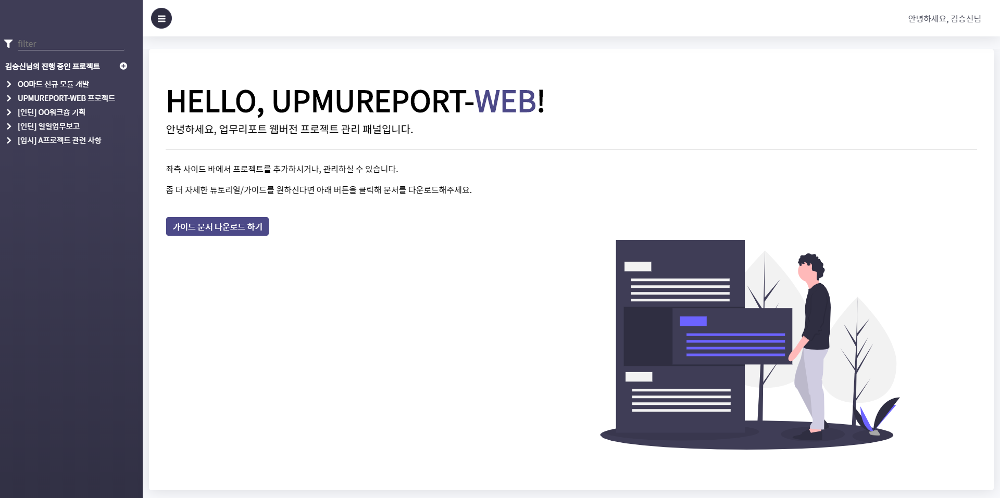

<!--
2019.05.23. 김승신

운영/배포 시 주의사항 및 대표 이미지 첨부
-->

# UPMUREPORT-WEB 📊

## 🔗 목차

<!-- @import "[TOC]" {cmd="toc" depthFrom=2 depthTo=6 orderedList=false} -->
<!-- code_chunk_output -->

* [🔗 목차](#목차)
* [🍈 UPMUREPORT-WEB 둘러보기](#upmureport-web-둘러보기)
* [📣 운영/개발 시 유의사항](#운영개발-시-유의사항)
	* [1. 운영 OS에 DB관련 환경변수는 필수입니다!](#1-운영-os에-db관련-환경변수는-필수입니다)
	* [2. 개발 IDE에도 환경변수 추가하는 것을 잊지마세요!](#2-개발-ide에도-환경변수-추가하는-것을-잊지마세요)

<!-- /code_chunk_output -->

 
 

## 🍈 UPMUREPORT-WEB 둘러보기

<table>
    <tr>
        <td colspan="2">
            
        </td>
    </tr>
	<tr>
		<td>
			
		</td>
		<td>
			
		</td>
	</tr>
</table>

 **UPMUREPORT-WEB**은 기존 upmureport.exe (C# 프로그램)의 **핵심 기능을 그대로 보전**하면서 **더 나은 인터페이스를 제공**하기 위해 만들어진 웹 앱입니다. **앱을 이용해 더 쉽고, 간편하게 업무를 관리**해보세요! 😄 

 
 

## 📣 운영/개발 시 유의사항

빌드 시 따로 프론트엔드 코드를 빌드하실 필요가 없습니다! maven 설정에 따라 maven package 시 prepare phase에서 react 코드가 빌드됩니다. 따라서 maven package만 실행하여 패키징하시면 되겠습니다. 단 스프링의 프로파일을 prod로 설정하고, 프론트엔드 코드 내의 API_CONSTANT에서 BASE_URL을 서버 URL로 설정한 뒤 패키징하셔야합니다.

### 1. 운영 OS에 DB관련 환경변수는 필수입니다!

UPMUREPORT-WEB은 아래와 같은 OS의 환경변수를 사용합니다.

    0. SERVER_PORT              // 서버 포트
    1. DATASOURCE_URL           // 운영DB 주소
    2. DATASOURCE_USERNAME      // 운영DB USERNAME
    3. DATASOURCE_PASSWORD      // 운영DB PASSWORD

따라서 OS 환경변수에 위 변수를 반드시 정의해야합니다.

### 2. 개발 IDE에도 환경변수 추가하는 것을 잊지마세요!

마찬가지로 개발 IDE에도 환경변수를 추가하셔야합니다. 아래는 Eclipse IDE의 Run Config 예시 화면과 환경 변수 목록입니다.

    0. SERVER_PORT              // 서버 포트
    1. DATASOURCE_URL           // 운영DB 주소
    2. DATASOURCE_USERNAME      // 운영DB USERNAME
    3. DATASOURCE_PASSWORD      // 운영DB PASSWORD
    4. DATASOURCE_URL_DEV
    5. DATASOURCE_USERNAME_DEV
    6. DATASOURCE_PASSWORD_DEV

<table>
    <tr>
        <td colspan="2">
            
        </td>
    </tr>
</table>

재개발 시 application.yml 의 프로파일을 'dev'로 변경하는 것과 frontend의 BASE_URL을 local로 바꾸는 것을 잊지마세요!