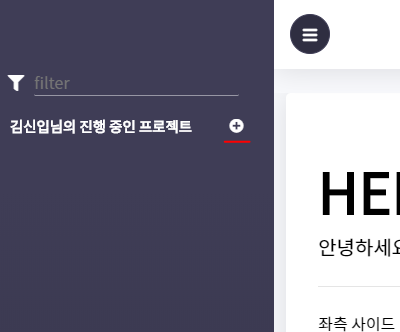
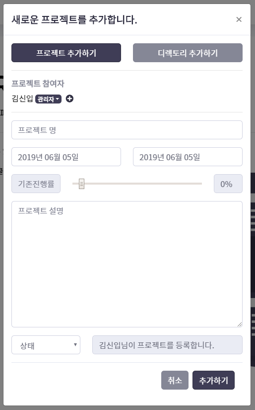
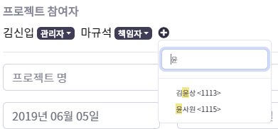
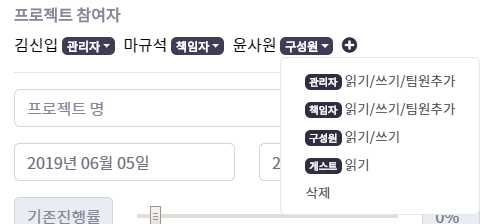
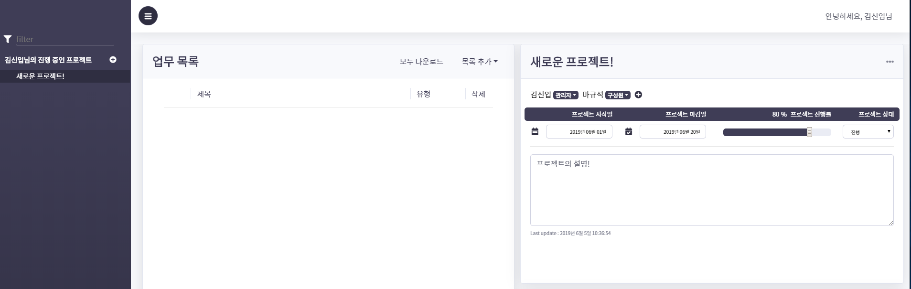
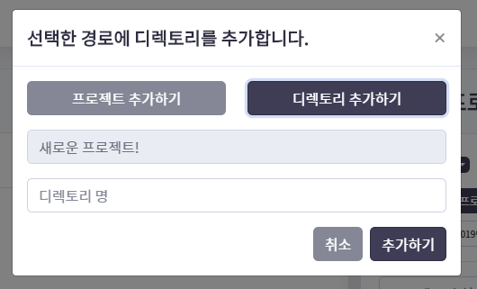
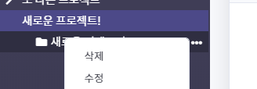
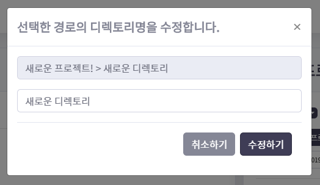
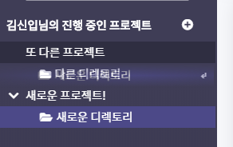

# 📊 UPMUREPORT-WEB 

## 🔗 목차

<!-- @import "[TOC]" {cmd="toc" depthFrom=2 depthTo=6 orderedList=false} -->
<!-- code_chunk_output -->

* [🔗 목차](#목차)
* [☀️  UPMUREPORT-WEB 둘러보기(가이드)](#span-classfa-fa-spin️span-upmureport-web-둘러보기가이드)
	* [1. 프로젝트 관리하기](#1-프로젝트-관리하기)
		* [프로젝트의 생성](#프로젝트의-생성)
		* [프로젝트의 수정](#프로젝트의-수정)
		* [프로젝트의 삭제](#프로젝트의-삭제)
	* [2. 디렉토리 관리하기](#2-디렉토리-관리하기)
		* [디렉토리의 생성](#디렉토리의-생성)
		* [디렉토리의 수정과 삭제](#디렉토리의-수정과-삭제)
	* [3. 업무 관리하기](#3-업무-관리하기)
		* [임시 소제목](#임시-소제목)
	* [4. 첨부파일 관리하기](#4-첨부파일-관리하기)
		* [임시 소제목](#임시-소제목-1)
	* [5. 로그 사용법](#5-로그-사용법)
		* [임시 소제목](#임시-소제목-2)
	* [6. 관리자 기능 사용하기](#6-관리자-기능-사용하기)
		* [임시 소제목](#임시-소제목-3)
* [📣 운영/개발 시 유의사항](#운영개발-시-유의사항)
	* [1. 운영 OS에 DB관련 환경변수는 필수입니다!](#1-운영-os에-db관련-환경변수는-필수입니다)
	* [2. 개발 IDE에도 환경변수 추가하는 것을 잊지마세요!](#2-개발-ide에도-환경변수-추가하는-것을-잊지마세요)

<!-- /code_chunk_output -->

 
 

## ☀️  UPMUREPORT-WEB 둘러보기(가이드)

<table>
    <tr>
        <td colspan="2">
            
        </td>
    </tr>
	<tr>
		<td>
			
		</td>
		<td>
			
		</td>
	</tr>
</table>

 **UPMUREPORT-WEB**은 기존 upmureport.exe (C# 프로그램)의 **핵심 기능을 그대로 보전**하면서 **더 나은 인터페이스를 제공**하기 위해 만들어진 웹 앱입니다. **앱을 이용해 더 쉽고, 간편하게 업무를 관리**해보세요! 😄 

 **UPMUREPORT-WEB**이 처음이시라면, 아이디를 관리자로부터 발급받고 로그인한 뒤 아래의 가이드를 따르세요.
 

### 1. 프로젝트 관리하기

#### 프로젝트의 생성

새로운 프로젝트를 생성하기 위해 왼쪽 상단의 "" 버튼을 클릭하세요. 이어서 프로젝트 추가 폼이 나타납니다.

<table>
	<tr>
		<td>
			
		</td>
		<td>
			
		</td>
	</tr>
</table>

프로젝트 추가 폼의 [프로젝트 추가하기, 디렉토리 추가하기] 탭 아래부터 표시하는 각 값들은 다음을 나타냅니다.

1. 프로젝트 참여자
	>프로젝트를 공유하는 팀원(사원)을 말합니다.
	>
	> 버튼을 누르면 사원을 검색하여 프로젝트에 추가할 수 있습니다. 
	>  
	>또 이름 옆의 권한 태그 드롭다운을 열면 권한 역시 조정할 수 있습니다.
	>  
1. 프로젝트 명
	>프로젝트의 이름입니다.
	>
	>프로젝트 이름은 공백일 수 없습니다.
1. 프로젝트 시작일, 마감일
	>프로젝트가 시작한(시작을 예정한) 날짜와 마감할(마감한) 날짜입니다.
	>
	>해당 필드를 눌러 달력 UI를 통해 날짜를 조정하거나, 텍스트로 직접입력할 수 있습니다.
	>마감일과 시작일을 역전하여 입력하지 않도록 주의하세요.
	>  
1. 진행률
	> 기존 CS UPMUREPORT와 마찬가지로 개개인의 프로젝트 진행율입니다.
	>
	> 단 프로젝트 생성 시 진행률은 모든 프로젝트 구성원의 진행률을 초기화하므로 유의하십시오.
	>즉, 구성원 각자의 초기화가 필요합니다.
1. 프로젝트
	> 프로젝트의 설명입니다.
	>
	> 특별한 제한사항은 없습니다.
1. 상태
	> 기존 CS UPMUREPORT와 마찬가지로 프로젝트의 상태입니다.
	>
	> 진행률과 마찬가지로 개개인에 적용되며 생성 시 진행률은 모든 프로젝트 구성원의 상태를 초기화합니다.
	>  

위의 필드를 알맞게 입력하셨다면...!

짠~ 멋진 첫 프로젝트를 만들었습니다. 축하드립니다!

#### 프로젝트의 수정

프로젝트는 팀원에 대한 변경권한을 가진 관리자/책임자 그리고 쓰기권한을 가진 구성원이 수정할 수 있습니다. 프로젝트의 상세보기 패널에 수정이 일어나면 상세보기 패널은 바로 수정 Form으로 변경됩니다.

<table>
	<tr>
		<td>
			
		</td>
		<td>
			
		</td>
	</tr>
</table>

각 필드는 위의 기술한 것과 동일하며, 프로젝트 진행률 및 프로젝트 상태는 각 개인의 고유한 것임을 유의하세요.

#### 프로젝트의 삭제

프로젝트 상세 패널의 제목줄 오른쪽 상단 "" 모양을 클릭하시면 드롭다운이 나타납니다.

해당 삭제하기를 클릭하시면 프로젝트와의 관계가 삭제됩니다. 단 여기서 삭제는 프로젝트에서 빠져나온다는 의미로, 공유하는 프로젝트 자체가 삭제되는 것은 아닙니다. 또 프로젝트와의 관계는 단순히 Disable되는 것에 불과하므로 관리자를 통해 복구하실 수 있습니다.

### 2. 디렉토리 관리하기

#### 디렉토리의 생성

먼저 디렉토리를 생성할 프로젝트 or 디렉토리를 선택하고 위의 프로젝트 추가 창에서 디렉토리 탭을 선택합니다.

디렉토리 추가 폼의 [프로젝트 추가하기, 디렉토리 추가하기] 탭 아래부터 표시하는 각 값들은 다음을 나타냅니다.

1. 추가할 경로
	> 디렉토리를 추가할 경로입니다.
	>
	> 추가될 경로를 > 구분자로 구분하여 나타냅니다.
2. 디렉토리 명
	> 디렉토리의 이름입니다.
	>
	> 특수문자를 입력하지 않도록 주의하십시오.

디렉토리 이름을 입력하고 추가하기 버튼을 클릭하시면 디렉토리가 생성됩니다.

#### 디렉토리의 수정과 삭제

디렉토리의 수정은 이름의 변경, 경로의 변경으로 나눌 수 있습니다. 먼저 삭제와 더불어 이름의 변경을 봅니다.

변경할 디렉토리의 오른쪽 ""을 클릭하시면 드롭다운이 나타납니다. 수정과 삭제 메뉴가 나타나는데, 말 그대로 삭제 시 디렉토리가 삭제되며, 수정을 누르면 이름을 변경할 수 있는 창이 나타납니다. 디렉토리 삭제와 수정 시 다른 팀원들에 영향을 미치므로 신중하시기 바랍니다. 여기서는 먼저 "수정"을 클릭합니다. 이어서 아래와 같은 창이 나타납니다.

디렉토리 이름란을 원하는 이름으로 입력하고, 수정하기를 누르면 변경이 완료됩니다.

디렉토리의 경로는 드래그 앤 드롭으로 변경할 수 있습니다.

위의 그림과 같이 이동할 디렉토리를 드래그 & 드랍 하세요. 디렉토리의 위치가 변경됩니다. 디렉토리 경로의 변경은 위의 수정/삭제와 마찬가지로 다른 프로젝트 인원에게 영향을 미치니 주의하십시오.

### 3. 업무 관리하기

#### 임시 소제목

### 4. 첨부파일 관리하기

#### 임시 소제목

### 5. 로그 사용법

#### 임시 소제목

### 6. 관리자 기능 사용하기

#### 임시 소제목

## 📣 운영/개발 시 유의사항

빌드 시 따로 프론트엔드 코드를 빌드하실 필요가 없습니다! maven 설정에 따라 maven package 시 prepare phase에서 react 코드가 빌드됩니다. 따라서 maven package만 실행하여 패키징하시면 되겠습니다. 단 스프링의 프로파일을 prod로 설정하고, 프론트엔드 코드 내의 API_CONSTANT에서 BASE_URL을 서버 URL로 설정한 뒤 패키징하셔야합니다.

### 1. 운영 OS에 DB관련 환경변수는 필수입니다!

UPMUREPORT-WEB은 아래와 같은 OS의 환경변수를 사용합니다.

    0. SERVER_PORT              // 서버 포트
    1. DATASOURCE_URL           // 운영DB 주소
    2. DATASOURCE_USERNAME      // 운영DB USERNAME
    3. DATASOURCE_PASSWORD      // 운영DB PASSWORD

따라서 OS 환경변수에 위 변수를 반드시 정의해야합니다.

### 2. 개발 IDE에도 환경변수 추가하는 것을 잊지마세요!

마찬가지로 개발 IDE에도 환경변수를 추가하셔야합니다. 아래는 Eclipse IDE의 Run Config 예시 화면과 환경 변수 목록입니다.

    0. SERVER_PORT              // 서버 포트
    1. DATASOURCE_URL           // 운영DB 주소
    2. DATASOURCE_USERNAME      // 운영DB USERNAME
    3. DATASOURCE_PASSWORD      // 운영DB PASSWORD
    4. DATASOURCE_URL_DEV
    5. DATASOURCE_USERNAME_DEV
    6. DATASOURCE_PASSWORD_DEV

<table>
    <tr>
        <td colspan="2">
            
        </td>
    </tr>
</table>

재개발 시 application.yml 의 프로파일을 'dev'로 변경하는 것과 frontend의 BASE_URL을 local로 바꾸는 것을 잊지마세요!