# UPMUREPORT-WEB 개발환경 구축 가이드

## 1. 설치 파일 목록

1. jdk 1.8
1. Eclipse STS 4 이상
    - [STS 공식 홈페이지](https://spring.io/tools)
1. Lombok
    - [lombok-1.18.4.jar](https://search.maven.org/remotecontent?filepath=org/projectlombok/lombok/1.18.4/lombok-1.18.4.jar)
    - [설치방법](https://www.baeldung.com/lombok-ide)
1. NodeJS 10.16.0 이상
    - [NodeJS 공식 홈페이지](https://nodejs.org/en/)
1. yarn
    - [Yarn 공식 홈페이지](https://yarnpkg.com/lang/en/)
1. MariaDB 
    - []()


## 2. ZIP 파일을 임포트하고 IDE 상에서 실행하기

상기 프로그램을 모두 다운로드 받고, ```upmureport-dev.zip```을 ```000.000.000.000```에서 다운로드 받습니다. JDK 등 기초 설

### a. Spring boot 서버 준비하기

STS를 실행하고 새로운 워크스페이스를 만든 뒤 왼쪽 상단 툴 바에서 아래와 같이 ```File > Open Projects from File System...```을 선택합니다.

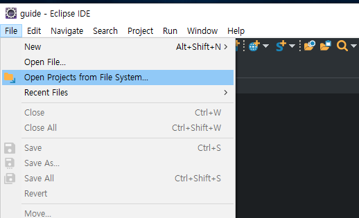

```Import source: ``` 인풋 오른쪽의 ```Archive...``` 버튼을 클릭합니다.

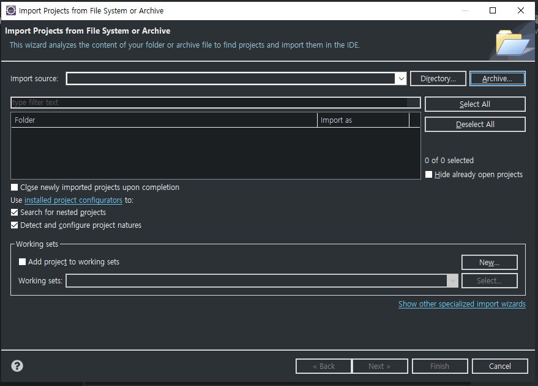

이어서 나타난 파일 선택창에서 준비한 ```upmureport-dev.zip```을 선택하고 엽니다.

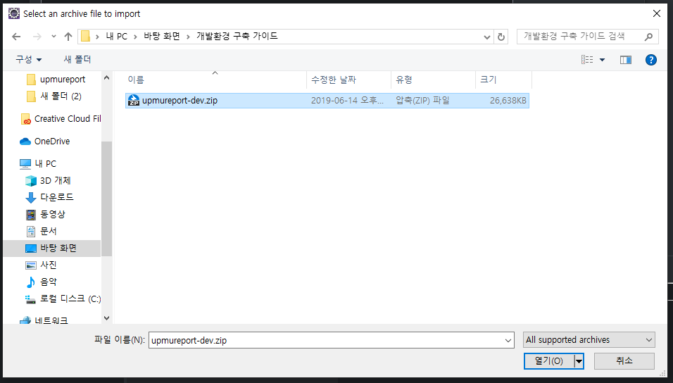

```Folder | import as``` 부분의 ```upmureport_dev.zip_expanded\upmureport-dev```만을 선택하고(Import as 란이 Maven인 항목), ```Finish```를 클릭하여 임포트합니다.

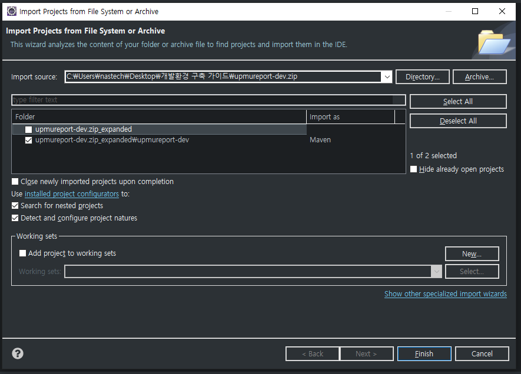

IDE가 프로젝트 빌드를 완료하면, Project Explorer는 다음과 같은 모습입니다. 만약 시간이 흐른 뒤에도 이 모습이 아니라면 ```Maven Update```를 통해 프로젝트를 업데이트 하십시오.

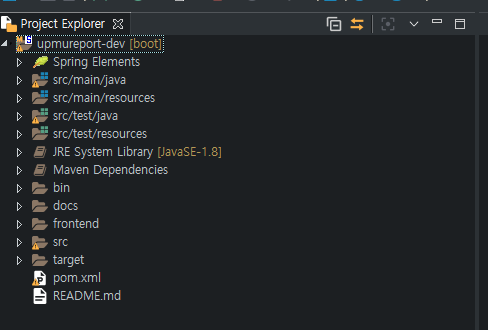

이제 실행 설정을 조정합니다. 아래와 같이 프로젝트에 오른쪽 클릭하고, ```Run As > Run Configuration...```을 선택합니다.

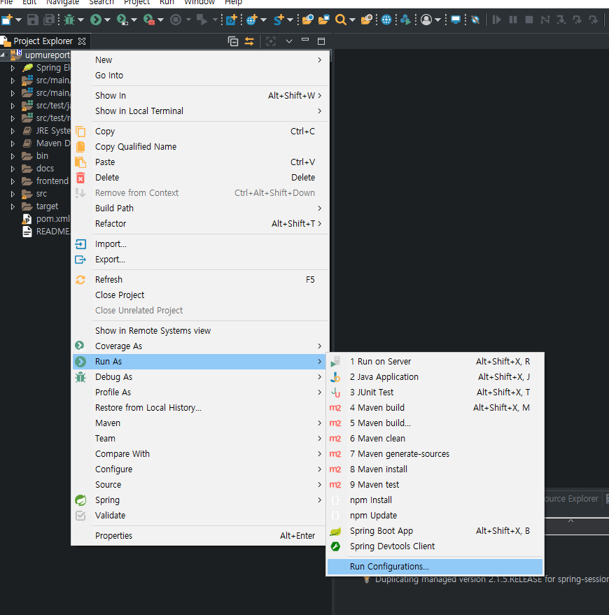

왼쪽 선택장에서 ```Spring Boot App```을 더블클릭하면 새로운 ```Run configurations``` 설정 창이 나타납니다.

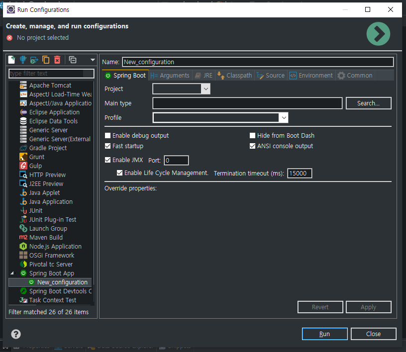

```Project```란을 ```upmureport-dev```로 선택하고, ```Search...```를 클릭하여 ```Main Type```을 ```Application - com.nastech.upmureport```로 선택합니다.

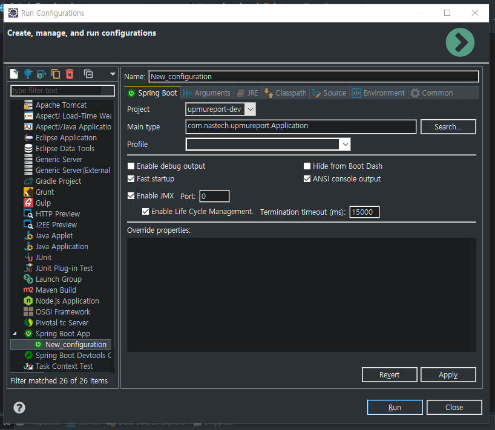

UPMUREPORT-WEB은 아래와 같은 OS의 환경변수를 사용합니다. 따라서 빌드 시에는 OS 환경변수에 아래 변수를 반드시 정의해야합니다. Eclipse는 실행 시 Run Config에 직접 환경 변수를 추가해야합니다. 


    0. SERVER_PORT              // 서버 포트
    1. DATASOURCE_URL           // 운영DB 주소
    2. DATASOURCE_USERNAME      // 운영DB USERNAME
    3. DATASOURCE_PASSWORD      // 운영DB PASSWORD
    4. DATASOURCE_URL_DEV       // 개발DB 주소
    5. DATASOURCE_USERNAME_DEV  // 개발DB USERNAME
    6. DATASOURCE_PASSWORD_DEV  // 개발DB PASSWORD

따라서  ```Environment``` 탭을 클릭하여 실행 시 환경 변수를 설정합니다. 아래는 Eclipse IDE의 Run Config 예시 화면과 환경 변수 목록입니다.

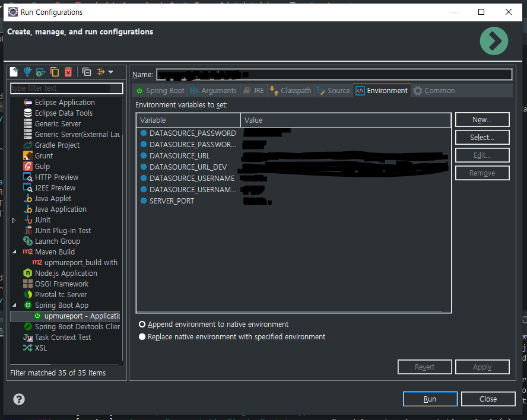

```Apply```를 클릭하고 ```Run```을 클릭하여 잘 실행되는 지 확인합니다.

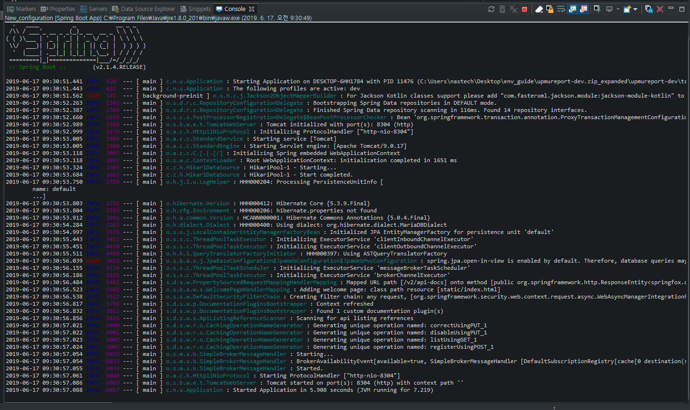


### b. react 개발 세팅

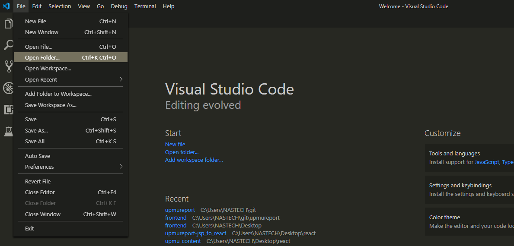


먼저 Visual Studio Code를 실행 시킵니다. 그 후 ```file``` - ```Open Folder``` 를 클릭합니다. 

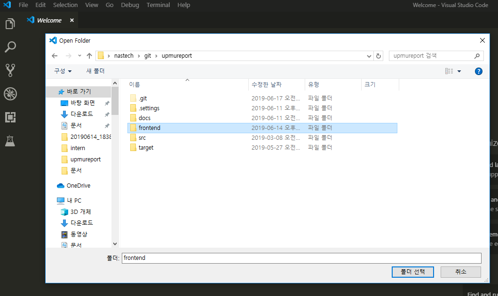

그 후 위에서 다운받은 경로의 frontend 폴더를 선택합니다.

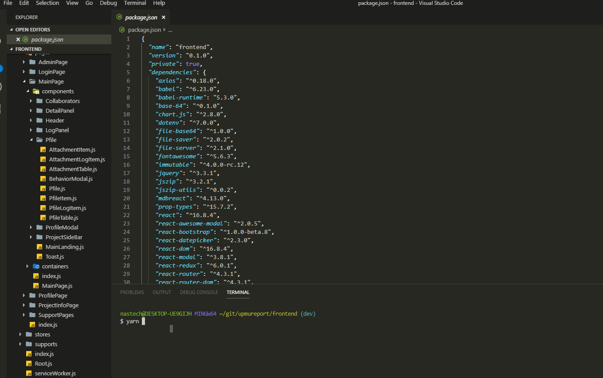

리액트 프로젝트에 추가된 라이브러리를 다운받기 위해서 터미널에 ```yarn``` 명령어를 칩니다.

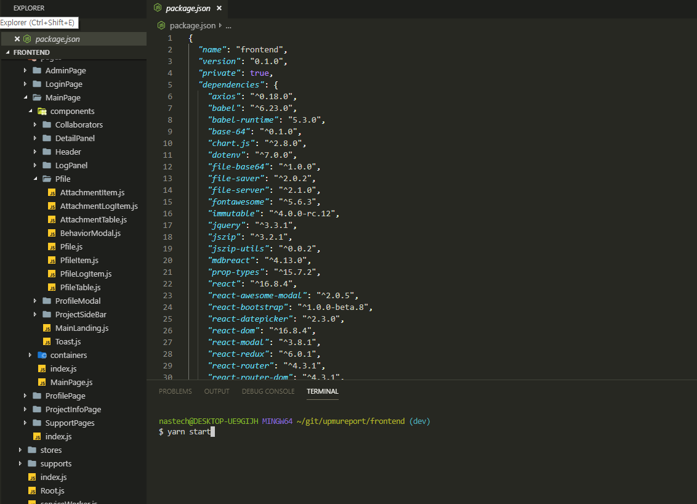

라이브러리들의 다운로드가 완료되면 서버를 실행시키기 위해서 ```yarn start``` 명령어를 사용하면 웹페이지가 뜹니다.